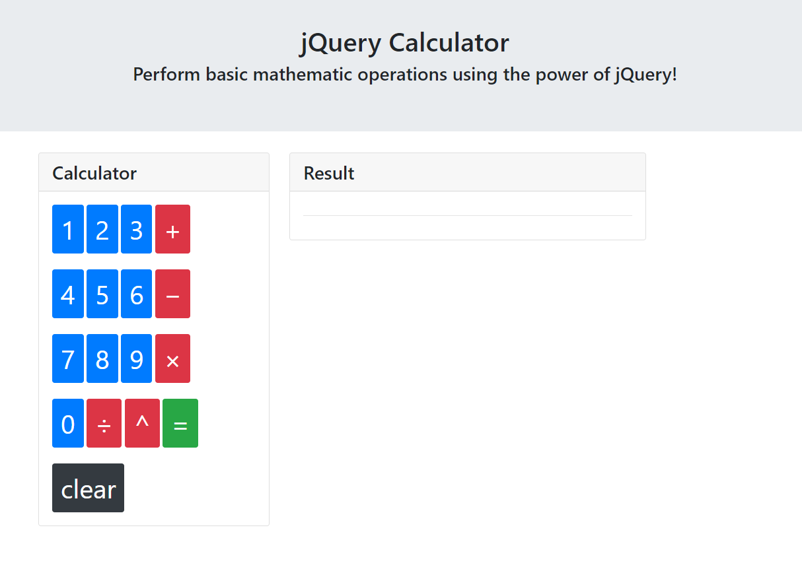

# jQuery Calculator

## File

* [`jquery-calculator-starter`](Unsolved/jquery-calculator.html)

## Instructions

* Created the JavaScript logic necessary to add functionality to the jQuery Calculator.

*  calculator should be able to handle basic mathematical operations like addition, subtraction, multiplication, etc.

## Mockup of this app

